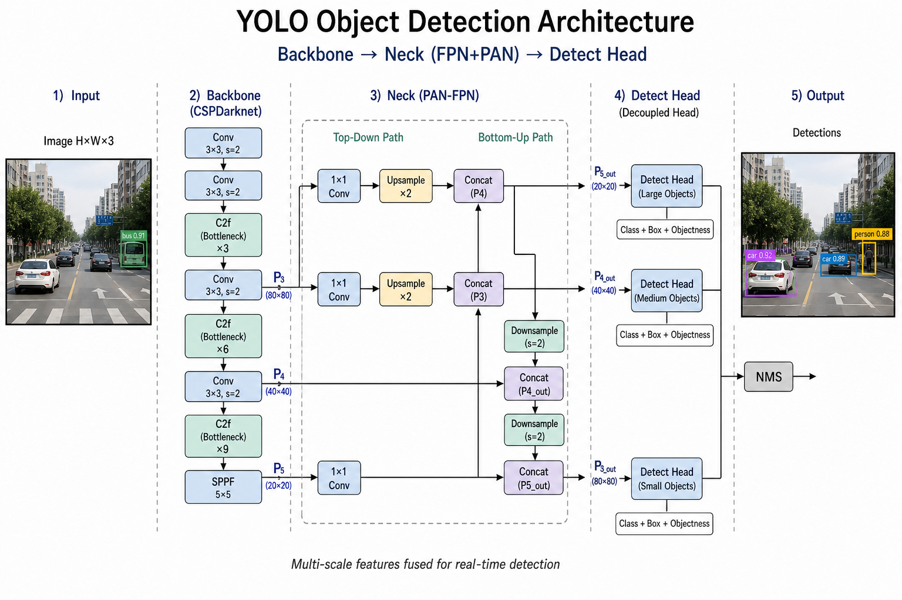
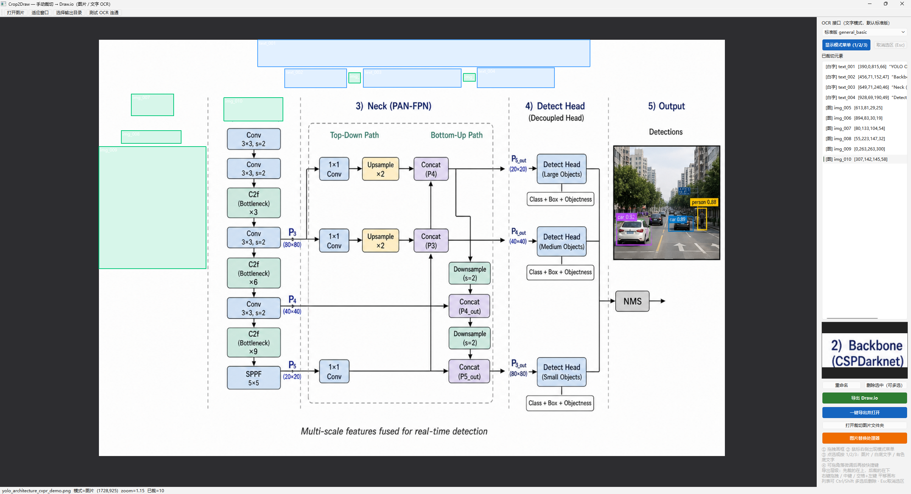
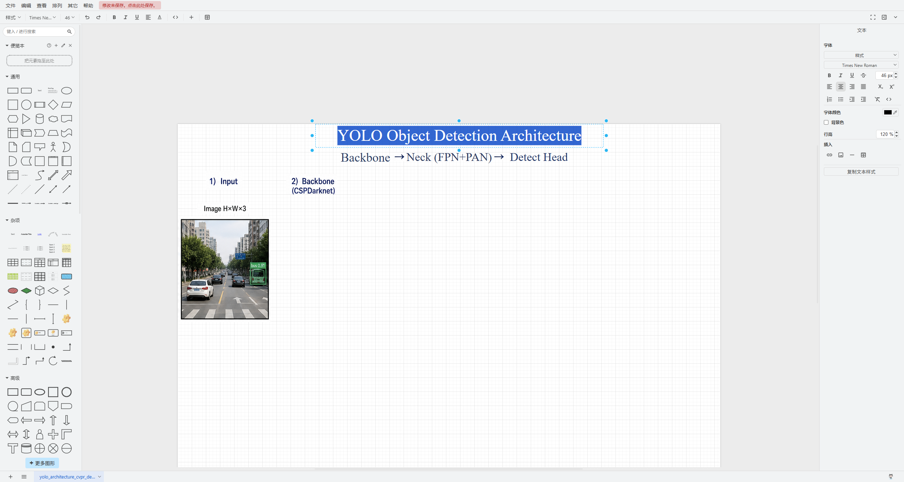
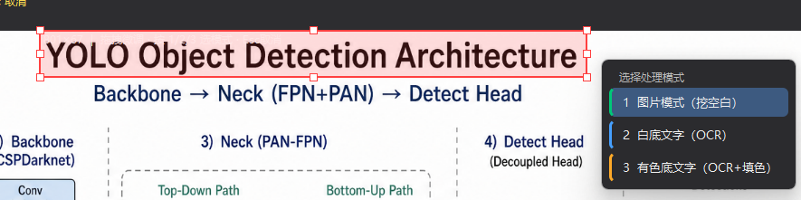
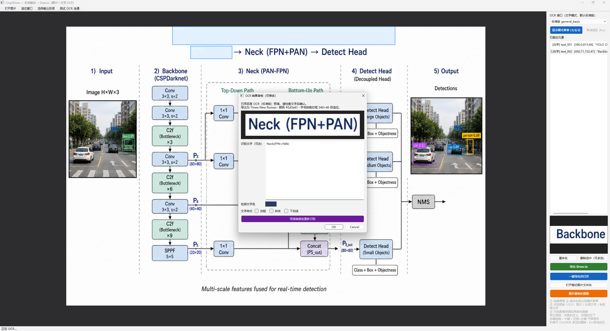
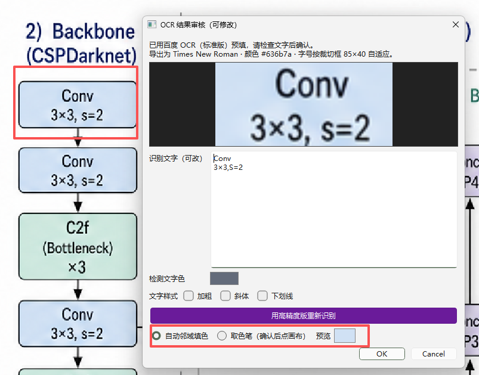
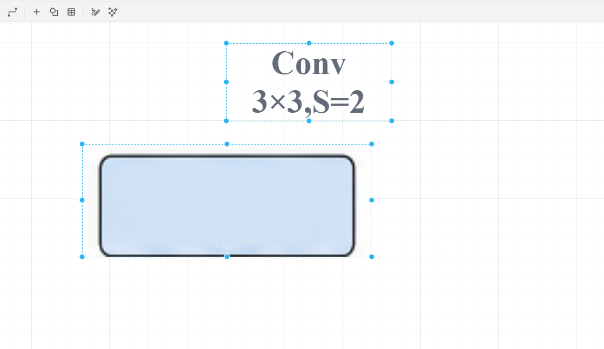

# Crop2Draw

Turn complex architecture figures into **editable [draw.io](https://www.diagrams.net/) files**.

Draw boxes on a bitmap figure, split it into image layers and OCR text cells, then export a `.drawio` you can fully edit — fonts, colors, sizes, and images.


**Repo:** https://github.com/ChenAI-TGF/Crop2Draw

---

## Motivation

If you work on paper reproduction or group meetings, you have probably hit this:

- The architecture figure for your slides is a flat bitmap — labels and arrows cannot be edited  
- Manual screenshot crops break layer order; cutting an outer frame also steals inner modules  
- Redrawing everything from scratch in draw.io is too slow  

**Crop2Draw** lets you crop on the original image with three modes — **image / white-background text / colored-background text** — and export an editable `.drawio` in one click.

---

## Demo

**Source figure to reconstruct:**



**After punch-out cropping:**



**One-click export to draw.io:**



Text is editable; font family, color, and size can be changed; image crops stay adjustable. AI-generated or scraped figures become a fully editable draw.io structure.

---

## What Crop2Draw does

One line: **crop a complex schematic into layers, then export draw.io.**

| Mode | Best for | Result |
| --- | --- | --- |
| `1` Image | Module blocks, icons, colored frames | PNG layer + punch-out on the canvas |
| `2` White-bg text | Titles, captions on white | OCR → editable draw.io text |
| `3` Colored-bg text | Labels on colored panels | OCR + fill (neighbor / eyedropper) |

### Highlights

- After drawing a box, pick a mode next to the cursor (shortcuts `1` / `2` / `3`):



- OCR: choose **Standard** or **Accurate** (Baidu API; configure keys locally). If Standard is weak, re-run Accurate from the review dialog (you may still need light manual fixes):



- After OCR, fill the punched region with **white** or the **surrounding color**, so you do not leave an ugly blank hole:





Text becomes editable while nearby rounded rectangles stay intact.

- **Image replace processor**: paste/drag a new image of a very different size; it is scaled with aspect ratio preserved into the target box  
- **One-click export & open** in draw.io Desktop  

API keys stay in local `secrets.json` and are never committed.

---

## Workflow

### 1. Install & run

```bash
git clone https://github.com/ChenAI-TGF/Crop2Draw.git
cd Crop2Draw
pip install -r requirements.txt

# Only needed for text OCR:
# Windows:  copy secrets.json.example secrets.json
# macOS/Linux: cp secrets.json.example secrets.json
# then fill in your Baidu OCR keys

python crop_to_drawio.py path/to/figure.png
```

Windows: double-click `run.bat`, or `run.bat path\to\figure.png`.

### 2. Cut inner modules first, outer frames later

Large frames (e.g. Backbone / Neck / Head) often wrap smaller blocks.  
**Crop the inner pieces first**, then the outer frame.  
Crop2Draw punches out finished regions, so the outer crop will not steal inner content.

### 3. Shortcuts: image `1`, text `2` / `3`

- Colored modules / icons → `1`  
- White-background labels → `2`  
- Text on colored panels → `3` (neighbor fill or eyedropper)  

Release the mouse to show the floating menu, or press `1` / `2` / `3` directly.

### 4. Review OCR & style

If Standard OCR is poor, click **Re-run with Accurate OCR**.  
You can toggle bold; font size is fitted to the crop box to reduce odd wrapping.

### 5. Replace low-res icons when needed

Open **Image replace processor** → pick the target crop → drag/paste a new image → contain-scale into the box.  
draw.io geometry stays the same (no stretch).

### 6. Export

Click **Export & open**: a translucent base image is included when text layers exist, for easy checking.  
**Layer order:** earlier crops sit **above** later ones — cut outer frames last so they do not cover inner parts.

---

## Requirements

- Python 3.10+  
- [PySide6](https://pypi.org/project/PySide6/), [Pillow](https://pypi.org/project/Pillow/)  
- Optional: [Baidu AI Cloud OCR](https://cloud.baidu.com/product/ocr) keys (text modes)  
- Optional: [draw.io Desktop](https://github.com/jgraph/drawio-desktop/releases) for “export & open”  

### Configure OCR (optional)

1. Copy `secrets.json.example` → `secrets.json`  
2. Fill in Accurate / Standard key pairs and `ocr_profile` (`"standard"` or `"accurate"`)  
3. `secrets.json` is gitignored — **never push real keys**  

Image-only workflows work without OCR keys.

### draw.io path (optional)

“Export & open” searches, in order:

1. `DRAWIO_PATH` environment variable  
2. Common install locations  
3. OS file association  

```bat
set DRAWIO_PATH=C:\Path\to\draw.io.exe
```

---

## Output layout

By default, next to the source image:

```text
<figure_stem>_manual_crops/
  crops/                 # PNG crops
  icons.json             # manifest
  <stem>_manual.drawio
```

---

## Project layout

```text
Crop2Draw/
  crop_to_drawio.py      # PySide6 UI + export
  baidu_ocr.py           # Baidu OCR client (reads secrets.json)
  secrets.json.example   # placeholder credentials
  requirements.txt
  run.bat / run.sh
  examples/              # README demo screenshots
  LICENSE                # MIT
  README.md
```

---

## Who is this for?

- Paper writing / group meetings where architecture labels and arrows must be editable  
- People who want editable draw.io results from AI-generated or web figures without redrawing from scratch  

---

## Security

- **Never commit `secrets.json`.**  
- Rotate keys if they were ever exposed in chat, logs, or screenshots.  
- This repo only ships `secrets.json.example` with placeholders.

---

## License

[MIT](LICENSE)

## Acknowledgements

- [draw.io / diagrams.net](https://www.diagrams.net/)  
- Baidu AI Cloud OCR API (optional, text modes)  
